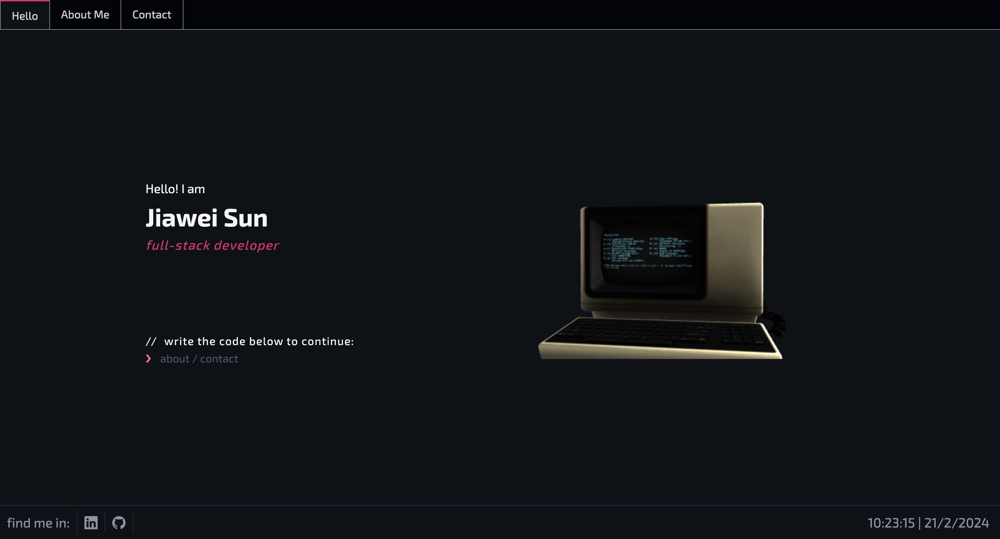

<div align="center">
      <h1> <br/>Personal Portfolio</h1>
     </div>

# Description

Personal Portfolio build using Next js, Three js, and Framer Motion

# Tech Used


## Live Preview

[Demo](https://rivajw.vercel.app/)

## Build Setup

```bash
# clone project
$ git clone https://github.com/rivajw/rivajw-portfolio.git

# install dependencies
$ npm install

# serve with host at localhost:3000
$ npm run dev
```

# Resource

    Google font: https://fonts.google.com/

    Design : https://dribbble.com/shots/17254830-Portfolio-Concept

    Original template src: https://github.com/kasim393/Nextjs-Portfolio
